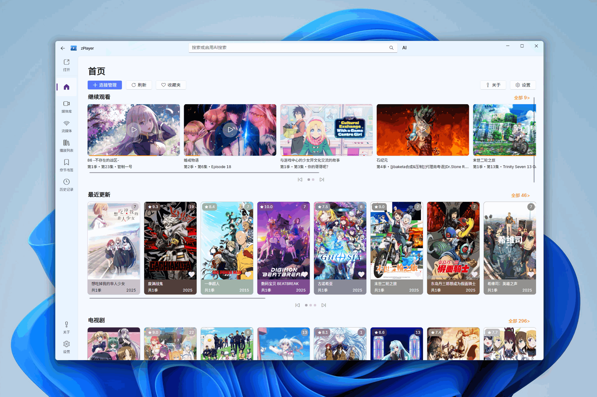
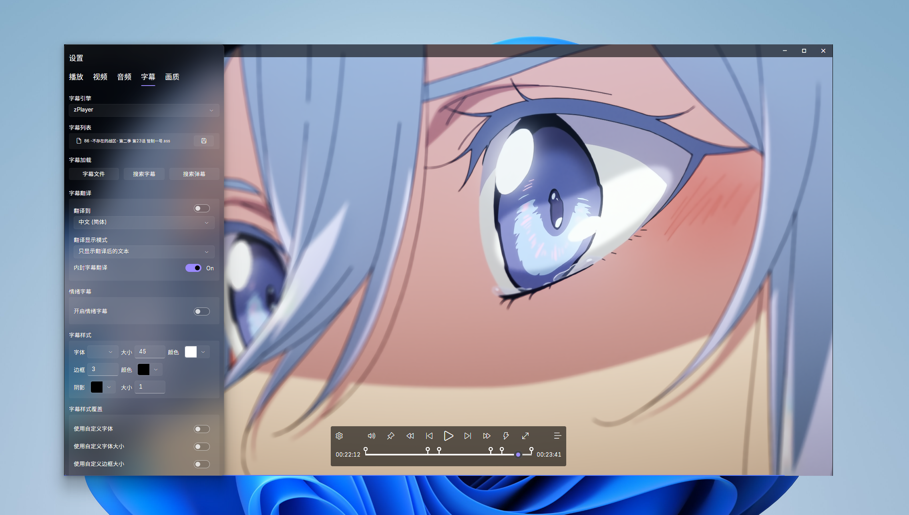

  

# zPlayer

让播放更智能，也更优雅

    <a title="Get From Microsoft Store (Stable)" href="https://apps.microsoft.com/detail/9N2P3RQ5VXXJ" target="_blank">
    ⭐ 正式版下载
    </a>
    |
    <a title="Get From Microsoft Store (Insider)" href="https://apps.microsoft.com/detail/9N7WV1DDL1GX" target="_blank">
    🧪 Insider 版下载
    </a>
    |
    <a title="Feedback & Issues" href="https://github.com/ZhaoYunxiong/zPlayer-Support/issues" target="_blank">
    🔊 反馈中心
    </a>

---

## 💡 概述 

zPlayer 是一款基于 **Avalonia** 的智能跨平台媒体播放器。它融合了播放、媒体管理、媒体刮削、AI 能力与 Fluent 设计美学，致力于让您的影音世界变得更有序、更纯粹、也更聪明。

### 🚀 极速媒体管理

zPlayer 能够以**极高的速度**接入您的媒体资源并生成精美的海报墙。

* **速度优势：** 媒体库刮削**速度极高**，大幅减少等待时间。
* **多源接入：** 支持本地文件夹及 **WebDAV**、**SMB**、**Alist**、**FTP** 等多种网络协议，并支持主流媒体服务器 **Emby**、**Jellyfin**、**Plex** 的无缝接入，将所有分散的媒体聚合为统一的体验。
* **记录同步：** 支持与媒体服务器双向同步播放历史、收藏状态、观看记录等。

### 🤖 AI 驱动的影音体验

zPlayer 内置 AI 系统，让播放不再是被动的观看。

> [!TIP]
> **AI 智能助手** 可以理解您的自然语言指令，帮助您生成内容摘要、推荐影片、甚至针对画面进行视觉提问。它真正参与到您的观影流程中，让播放具备思考的能力。

### 🖼️ 原生级设计与高画质

应用基于 **Avalonia**，并深度实现 Fluent Design System 的设计规范，为您带来一致、优雅的跨平台体验。

* **视觉效果：** 采用光影、层次与柔和动效，呈现安静的力量。
* **画质增强：** 内置支持 **Anime4K**、**补帧**、**着色器**等高阶滤镜和处理技术，为您的每一次播放进行精心调校。

---

## 🛠️ 关键功能特性 

| 特性分类 | 核心功能点 |
| :--- | :--- |
| **媒体管理** | 支持本地、FTP、SMB、WebDAV 等多源挂载；无缝接入 Emby/Jellyfin/Plex。 |
| **播放系统** | 兼容多格式，高性能解码；硬件加速支持；音轨/字幕/弹幕/画质丰富调整。 |
| **智能工具** | AI驱动媒体处理工具箱（转码、剪辑、字幕提取）；知识管理导出（Markdown 笔记）。 |
| **交互辅助** | 播放历史、收藏夹、书签与笔记系统；插件扩展系统。 |

---

## 🖥️ 平台支持 

zPlayer 致力于提供原生级的跨平台体验，支持主流操作系统（Linux及移动端有空后再推出）：

| 平台类型 | 支持系统 |
| :--- | :--- |
| **桌面端** | Windows · macOS · Linux |
| **移动端** | Android · iOS · NAS |

---

## 💬 结语与致谢

zPlayer 想陪您慢下来，让智能与设计共生，让播放成为一种生活方式。

> [!NOTE]
> 感谢所有支持我们的用户和内测人员。您的反馈与信任是驱动 zPlayer 不断进步的唯一动力。

---

#### 🔗 联系我们

* **反馈与 Bug 报告：** [本仓库 Issues 区，点击提交 Issue](https://github.com/ZhaoYunxiong/zPlayer-Support/issues)
* **其他联系方式：** panda8833657@live.com